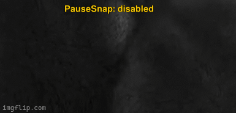

<div align="center">

# PauseSnap


</div>

An MPV Lua script that automatically takes screenshots when you pause videos. This script has evolved through several iterations based on my own use cases and some community feedback. Because who has time to remember the screenshot hotkey every single time?

## Features

- **Auto-screenshot on pause**: Automatically captures a screenshot whenever you pause a video
- **Toggle on/off**: Customizable keybinding to enable/disable (default: `Ctrl+'`)  
- **Multiple screenshot methods**: Choose between "subtitles" (includes subs), "video" (raw frame), or "window" (includes MPV UI)
- **Custom directories**: Save screenshots to any directory you want
- **Flexible filename templates**: Use MPV's property expansion system for dynamic filenames
- **Colored OSD notifications**: Customizable hex color for status messages
- **Non-destructive**: Preserves your existing MPV screenshot settings


## Basic Installation

Drop [`pausesnap.lua`](pausesnap.lua) into your MPV scripts directory:

```bash
# Linux/macOS
~/.config/mpv/scripts/pausesnap.lua

# Windows
%APPDATA%/mpv/scripts/pausesnap.lua
```

### Configuration File (Optional)

Create `~/.config/mpv/script-opts/pausesnap.conf` for custom settings:

```ini
# Enable/disable on startup
enabled=true

# Keybinding for toggling (MPV keybind syntax)
toggle_key=Ctrl+'

# OSD message color (RGB hex, no # prefix)
osd_color=00FF00

# Screenshot method: "subtitles", "video", or "window"  
screenshot_method=subtitles

# Custom directory (absolute path, empty for MPV default)
screenshot_dir=/home/user/screenshots

# Filename template using MPV property expansions
screenshot_template=%F-%{metadata/title}-%p
```

## Configuration Options

### `toggle_key` (default: `"Ctrl+'"`)
Keybinding to toggle PauseSnap on/off. Uses MPV keybinding syntax:
- `"p"` - Simple key
- `"Ctrl+p"` - Control modifier
- `"Ctrl+Shift+p"` - Multiple modifiers  
- `"Alt+s"` - Alt modifier

### `screenshot_method` (default: `"subtitles"`)
Determines what gets captured in the screenshot:
- `"subtitles"` - Video frame with burned-in subtitles (most useful)
- `"video"` - Raw video frame without subtitles or UI
- `"window"` - Entire MPV window including UI elements


### `screenshot_template` (default: `"%F-%p"`)
Filename template using MPV property expansions. Common expansions:
- `%F` - Video filename without extension
- `%f` - Video filename with extension
- `%p` - Current playback position (HH:MM:SS format)
- `%P` - Current playback position as integer seconds
- `%{metadata/title}` - Video title from metadata
- `%{metadata/artist}` - Artist from metadata
- `%wH` - Video width
- `%wW` - Video height

Example templates:
```ini
# Basic: filename-timestamp
screenshot_template=%F-%p

# With title: filename-title-timestamp  
screenshot_template=%F-%{metadata/title}-%p

# Organized: YYYY-MM-DD_filename_HH-MM-SS
screenshot_template=%{time-pos:%Y-%m-%d}_%F_%{time-pos:%H-%M-%S}
```

### Core Architecture

The script uses MPV's property observation system to monitor pause state changes:

```lua
mp.observe_property("pause", "bool", on_pause_change)
```

When `pause` transitions from `false` to `true`, the `on_pause_change` callback triggers the screenshot mechanism.

### ASS Color Conversion

OSD messages use MPV's ASS (Advanced SubStation Alpha) subtitle renderer, which requires colors in BGR format rather than RGB:

```lua
-- Convert RGB hex "00FF00" to BGR "00FF00" -> becomes "&H00FF00&" in ASS
local function hex_to_ass_color(hex_color)
    local r, g, b = hex_color:sub(1,2), hex_color:sub(3,4), hex_color:sub(5,6)
    return b .. g .. r  -- BGR for ASS
end
```

The final ASS markup: `{\\c&HBGR&}text{\\c}` where `BGR` is the converted hex value.

### Key Binding Registration

Dynamic key bindings use MPV's binding system:

```lua
mp.add_key_binding(opts.toggle_key, "toggle-pausesnap", toggle_function)
```

The binding name "toggle-pausesnap" can be remapped in `input.conf` if needed.


## Troubleshooting

### Common Issues
**Screenshots not saving to custom directory**  
- Verify directory exists and has write permissions
- Use absolute paths only (no `~` or relative paths)
- Check MPV console output for permission errors

**Invalid screenshot method errors**  
Script falls back to "subtitles" method for invalid values. Check spelling in config file.

**OSD messages appear white despite custom color**  
Invalid hex color format. Use 6-character hex without `#` prefix (e.g., `"FF0000"` not `"#FF0000"`).

### Debug Information

Enable debug logging in MPV to see PauseSnap's internal state:

```bash
mpv --msg-level=all=debug . | grep pausesnap
```

Look for `[pausesnap](pausesnap.lua)` prefixed messages in the output.
## Advanced Usage
### Multi-Key Bindings

You can create multiple toggle bindings by editing the config:

```ini
# Primary toggle
toggle_key=Ctrl+'

# Alternative in input.conf:
# Alt+s script-binding toggle-pausesnap
```

### Custom OSD Duration

Modify the `show_osd_message()` function to change display duration:

```lua
show_osd_message("Message", 3000)  -- 3 seconds instead of default 2
```

### Event Extensions

The script architecture supports additional events. You could extend it to screenshot on:
- Seek events (`mp.observe_property("time-pos", "number", callback)`)
- Chapter changes (`mp.observe_property("chapter", "number", callback)`)  
- Specific timestamps

### Integration with External Tools

Screenshots can be post-processed by modifying the `take_screenshot()` function to execute external commands after capture:

```lua
-- After mp.commandv("screenshot", method)
mp.command_native_async({
    name = "subprocess",
    args = {"your-post-process-script.sh", screenshot_path},
    playback_only = false
})
```

## License
Use it, modify it, break it, fix it - whatever makes you happy.

